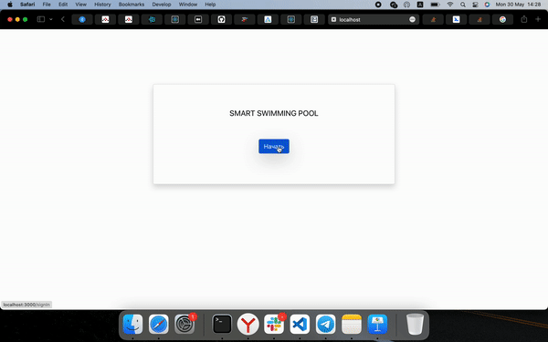

# Smart swimming pool

Клиентская часть приложения для оператора малогабаритного тренировочно-оздоровительного бассейна с противотоком. 
Вклюючает в себя эмулятор работы сервера.

## Система

Основная задача системы заключается в том, чтобы изменять скорость течения воды в бассейне в зависимости от пульса пользователя. Для этой системы предусматривается приложение, с помощью которого оператор системы (врач, тренер, и проч.) сможет контролировать или изменять параметры текущей тренировки. Эта система найдет применение в реабилитационных центрах, спортивных комплексах и других организациях, где необходимо проводить персонализированные тренировки и отслеживать прогресс конкретного пользователя в условиях ограниченного пространства.

## Технологии разработки

   

 

## Диаграмма вариантов использования приложения (use-case)

